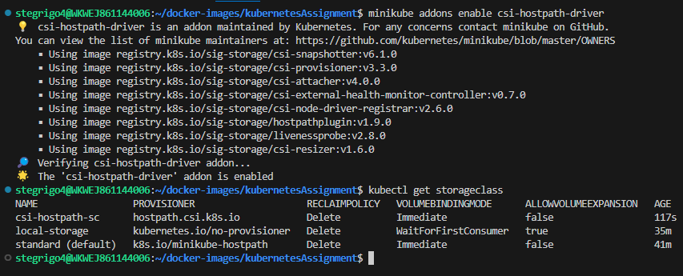
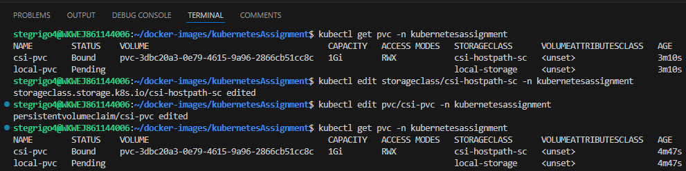
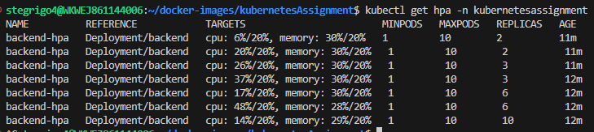

# Kubernetes Application

This is the second assignment that focuses on Kubernetes and managing a multi-tier application.
## App Creation
In order to use Kubernetes to manage a cluster we need to create an application to run in said cluster.
The technologies that this application is based on are:
- ```Python + Flask (Web Framework)```
- ```React JS for Frontend```
- ```PostgreSQL 13```
Each service is run in its own separate container and was tested using ```Docker``` to ensure communication between them.
In order to user the ```.env``` file i had to add it to both the root directory of the project as well as the ```/backend``` directory in order to make sure the application containers communicate correctly.<br />

# Tasks 
## 1. Kubernetes Cluster Setup 
### Set up a Kubernetes cluster using a tool of your choice.
I decided to use ```minikube```, a tool that sets up a ```Kubernetes``` environment locally.
```
stegrigo4@WKWEJ861144006:~/docker-images/kubernetesAssignment$ minikube start
😄  minikube v1.33.1 on Ubuntu 22.04 (amd64)
✨  Automatically selected the docker driver
📌  Using Docker driver with root privileges
❗  For an improved experience it's recommended to use Docker Engine instead of Docker Desktop.
Docker Engine installation instructions: https://docs.docker.com/engine/install/#server
👍  Starting "minikube" primary control-plane node in "minikube" cluster
🚜  Pulling base image v0.0.44 ...
🔥  Creating docker container (CPUs=2, Memory=3900MB) ...
🐳  Preparing Kubernetes v1.30.0 on Docker 26.1.1 ...
    ▪ Generating certificates and keys ...
    ▪ Booting up control plane ...
    ▪ Configuring RBAC rules ...
🔗  Configuring bridge CNI (Container Networking Interface) ...
🔎  Verifying Kubernetes components...
    ▪ Using image gcr.io/k8s-minikube/storage-provisioner:v5
🌟  Enabled addons: storage-provisioner, default-storageclass
🏄  Done! kubectl is now configured to use "minikube" cluster and "default" namespace by default
```
### Configure kubectl to interact with your cluster.
For ```minikube``` i don't need to configure kubectl as it's done automatically, but if i had to would need to modify this file.
```
stegrigo4@WKWEJ861144006:~/docker-images/kubernetesAssignment$ cat ~/.kube/config 
apiVersion: v1
clusters:
- cluster:
    certificate-authority: /home/stegrigo4/.minikube/ca.crt
    extensions:
    - extension:
        last-update: Mon, 02 Sep 2024 13:42:10 EEST
        provider: minikube.sigs.k8s.io
        version: v1.33.1
      name: cluster_info
    server: https://127.0.0.1:56755
  name: minikube
contexts:
- context:
    cluster: minikube
    extensions:
    - extension:
        last-update: Mon, 02 Sep 2024 13:42:10 EEST
        provider: minikube.sigs.k8s.io
        version: v1.33.1
      name: context_info
    namespace: default
    user: minikube
  name: minikube
current-context: minikube
kind: Config
preferences: {}
users:
- name: minikube
  user:
    client-certificate: /home/stegrigo4/.minikube/profiles/minikube/client.crt
    client-key: /home/stegrigo4/.minikube/profiles/minikube/client.key
``` 
### Submit a screenshot of the output of kubectl get nodes and kubectl version.


## 2. Application Deployment

### Create Kubernetes Deployments for the frontend and backend applications.
In order to use the images i built for these it was necessary to push them to Dockerhub.
<br />

<br /> Now that i have the images i created a ```yaml``` file for each deployment as well as for the secrets file, we will talk about that one later.
Backend and databse pods use the same secrets to link the ```PostgreSQL database``` to the ```Python Flask API```.
```
apiVersion: apps/v1
kind: Deployment
metadata:
  labels:
    app: frontend
  name: frontend
  namespace: {{ .Values.namespace }}
spec:
...
      containers:
      - image: grigorescustefan/frontend:v3
        name: frontend
```
```      
apiVersion: apps/v1
kind: Deployment
metadata:
  labels:
    app: backend
  name: backend
  namespace: {{ .Values.namespace }}
spec:
...
      containers:
      - image: grigorescustefan/backend:v1
          name: backend
```

### Set up a StatefulSet for the PostgreSQL database.
In order to setup a StatefulSet for PostgreSQL we need to create another yaml file. We will define the variables necessary for the database, the name for the container, the number of replicas, etc...
```
apiVersion: apps/v1
kind: StatefulSet
metadata:
  name: postgresql
  labels:
    app: postgresql
  namespace: {{ .Values.namespace }}
spec:
...
containers:
      - image: postgres:13
        name: postgresql
        env:
        - name: POSTGRES_DB
          valueFrom:
            secretKeyRef:
              name: env-secrets
              key: POSTGRES_DB
        - name: POSTGRES_USER
          valueFrom:
            secretKeyRef:
              name: env-secrets
              key: POSTGRES_USER
        - name: POSTGRES_PASSWORD
          valueFrom:
            secretKeyRef:
              name: env-secrets
              key: POSTGRES_PASSWORD
        ports:
          - containerPort: 5432
```
After creating the yaml file and executing it we get the StatefulSet up and running.<br />


### Create Services to expose the applications within the cluster.
I have created three more yaml files for the services necessary to expose the resources.
```
apiVersion: v1
kind: Service
metadata:
  name: postgresql
spec:
  selector:
    app: postgresql
  ports:
  - protocol: TCP
    port: 5432
    targetPort: 5432
```
For the frontend i have used NodePort so it can be accessed from outside the cluster, and ClusterIP for backend as it only needs to communicate with the backend inside it.
```
apiVersion: v1
kind: Service
metadata:
 name: frontend-expose
 namespace: {{ .Values.namespace }}
spec:
 type: NodePort
 selector:
   app: frontend
 ports:
 - nodePort: 30000
   protocol: TCP
   port: 80
   targetPort: 80
```
```
apiVersion: v1
kind: Service
metadata:
 name: backend-service
 namespace: {{ .Values.namespace }}
spec:
 selector:
   app: backend
 ports:
 - protocol: TCP
   port: 5000
   targetPort: 5000
```

<br />
<br />In order to get the data from the backend when it is requested from the frontend UI, i needed to configure Nginx as a reverse proxy, so it knows to what resource to connect when a certain endpoint is accessed.


### Implement an Ingress resource for external access to the frontend. 
As of now, the database works as intended, and the backend pulls the right data, now we need to link it with the frontend.
To do that we can use an ingress resource to facilitate communication between the two, as JavasScript runs in the browser and can't access cluster related services. First we need to enable ingress using the ```minikube addons enable ingress``` command.
```
stegrigo4@WKWEJ861144006:~/docker-images/kubernetesAssignment/kubernetes_yaml$ minikube addons enable ingress
💡  ingress is an addon maintained by Kubernetes. For any concerns contact minikube on GitHub.
You can view the list of minikube maintainers at: https://github.com/kubernetes/minikube/blob/master/OWNERS
    ▪ Using image registry.k8s.io/ingress-nginx/kube-webhook-certgen:v1.4.1
    ▪ Using image registry.k8s.io/ingress-nginx/kube-webhook-certgen:v1.4.1
    ▪ Using image registry.k8s.io/ingress-nginx/controller:v1.10.1
🔎  Verifying ingress addon...
🌟  The 'ingress' addon is enabled
```
Once the addon for ingress provided by minikube was enabled, it was time to create the ```ingress.yaml``` resource file.
```
apiVersion: networking.k8s.io/v1
kind: Ingress
metadata:
  name: backend-ingress
  namespace: {{ .Values.namespace }}
spec:
  ingressClassName: nginx
  rules:
    - host: backend.ingress
      http:
        paths:
          - path: /
            pathType: Prefix
            backend:
              service:
                name: backend-expose
                port:
                  number: 80
```
This resource will map the address ```http://backend.ingress``` to the backend service based on the path provided.
In order to use it well we need to map the ```minikube ip``` to this DNS host in order to access it, which require ```root``` access.<br />

<br />Now we need to check and see if the ingress is working. It seems to have successfully mapped the minikube ip to the host. 
```
NAME              CLASS   HOSTS             ADDRESS        PORTS   AGE
backend-ingress   nginx   backend.ingress   192.168.49.2   80      44s
```

It is not possible to create an ingress resource using minikube and WSL2.

### Submit your YAML manifests and a brief explanation of your deployment strategy.
All the ```yaml``` files i used throughout this assignment are stored inside ```/kubernetes_yaml``` directory.
My deployment strategy is very simple:
<br /> - I created two ```Docker images```, one for the frontend side with the ```React``` application, and one for the backend side using ```Flask``` and ```Python```.
<br /> - I created two deployment ```yaml``` files for each using the images that i pulled from ```DockerHub```.
<br /> - I used a ```StatefulSet``` in order to deploy the ```PostgreSQL``` database, which currently only has one replica but can be modified easily.
<br /> - It was necessary to create a ```Persistent Volume``` in order to deploy the the ```PostgreSQL StatefulSet```
<br /> - I created three services for each resource to expose them inside and outside the cluster, depending on the necessity.
<br /> - I used a ```ConfigMap``` to add data to my database as in this configuration it will not change as the scope of the application doesn't require it to.
<br /> - In order to access the files from outside the cluster it was necessary to create an ```Ingress Resource``` that can map traffic from one URL to a certain service, pod, deployment, etc...
These Files can be easily modified and applied to the cluster.

## 3. Configuration Management 

### Use ConfigMaps to manage application configurations. 
```
apiVersion: v1
kind: ConfigMap
metadata:
  name: db-init-configmap
data:
  init.sql: |
    CREATE TABLE IF NOT EXISTS test_table (
        id SERIAL PRIMARY KEY,
        name VARCHAR(100)
    );

    INSERT INTO test_table (name) VALUES
    ('Grigo'),
    ('React.JS + Flask + PostgreSQL'),
    ('Kubernetes Assignment');
```
```
...
logstash.conf: |-
      input 
      { 
        beats  {
            port=> 5400      
        }

      }

      filter{
        
      }

      output 
      {
          elasticsearch { 
              hosts => ["es-service:9200"] 
            }

      }
```
```
filebeat.autodiscover:
  providers:
    - type: kubernetes
      hints.enabled: true
      templates:
          config:
            - type: container
              paths:
                - /var/log/containers/*${data.kubernetes.container.id}.log          
output.logstash:
  hosts: ["logstash-service:5400"]
```
### Implement Secrets to store sensitive information.
The format of the ```.env``` file is of such:
```
DB_NAME=
DB_USER=
DB_PASSWORD=
DB_HOST=
```
As i declared a ```.env``` file before and now i need those values inside a secrets for Kubernetes i used the command.<br />
```kubectl create secret generic env-secrets --from-env-file=./.env --dry-run=client -o yaml```<br />
It created a yaml file that i could save for later and deploy with the rest of the application as needed. This file called ```secrets.yaml``` i made sure to add inside of ```.gitignore```.
```
apiVersion: v1
data:
  DB_HOST: [redacted]
  DB_NAME: [redacted]
  DB_PASSWORD: [redacted]
  DB_USER: [redacted]
kind: Secret
metadata:
  name: env-secrets
```
### Explain how you've used these resources and why they're important. 
I used the ```ConfigMap``` to add data to my ```PostgreSQL``` because i do not need to modify said data, only to display it on the frontend side, so it was a convenient way to do it. ```Secrets``` on the other hand are necessary ```key-value``` pairs that facilitate the connection between the database and the backend-service, so it was necessary to create a different yaml file that can be accessed by both and save said values as ```environment variables```.

## 4. High Availability and Service Quality 

### Implement Pod Disruption Budgets for the frontend and backend services. 
In order to implement PDB for both services we just need to add 2 more ```yaml``` files that have the same form.
```
apiVersion: policy/v1
kind: PodDisruptionBudget
metadata:
  name: [name of the pdb]
spec:
  minAvailable: [chosen number]
  selector:
    matchLabels:
      app: [target component]
```
These configurations will ensure that there are at least ```[minAvailable]``` number of pods running during disruptions.

### Configure different Quality of Service (QoS) classes for your pods (Guaranteed, Burstable, BestEffort). 
In order to semi-accurately allocate resources for the pods, first we need to see what resources are consumed by the pods in idle and when in use. For that we need to monitor the pods. For that we can use ```kubectl top``` which displays the pods/nodes using the most resources.
I encountered an error for it saying ```error: Metrics API not available``` which i fixed following this tutorial:
<br /> ```https://computingforgeeks.com/fix-error-metrics-api-not-available-in-kubernetes/```
Now that the ```Metrics API server works``` we can check the pods that take the most resources with ```kubectl top pods```<br />

<br />Now that we know what the resources take on average (between idle and in use the difference is at best 5Mi of Memory for all resources and 2-4m for CPU cores). 
The ```QoS classes``` that we can use are:
<br />```Guaranteed``` - every Container in the Pod:
* must have a CPU limit and CPU request
* must have a memory limit and memory request
* both for CPU and memory, the limit and request values must be equal

<br />```Burstable```:
* At least one Container in the Pod has a memory or CPU request or limit
* Does not fit critera for ```Guaranteed```

<br />```BestEffort```:
* can use node resources that aren't specifically assigned to Pods in other ```QoS classes```

### Explain your choices and their implications. 
I decided to give both the ```PostgreSQL pods``` and the ```Backend pods``` the ```Guaranteed class``` so they are the least likely to be killed in the event of resource drought, and for the ```Frontend pods``` i decided to give it the ```Burstable class``` so it can have a base memory request to run smoothly. These configurations have been made in the follow up category.

## 5. Resource Management 
### Set resource requests and limits for all containers. 
Resource limits are the maximum allowed for that specific resource, while resource requests tell the kubelet to reserve at least the ```requests``` amount for the container to use..
In order to set limits and requests for all the pods we can add this section to each ```Deployment``` and ```StatefulSet``` yaml file.
<br />```PostgreSQL pods```:
```
resources: 
  requests:
    memory: "100Mi"
    cpu: "10m"
  limits: 
    memory: "100Mi"
    cpu: "10m"
```
<br />Backend pods:
```
resources: 
  requests:
    memory: "75Mi"
    cpu: "15m"
  limits: 
    memory: "75Mi"
    cpu: "15m"
```
<br />Frontend pods:
```
resources: 
  limits:
    memory: "20Mi"
    cpu: "5m"
```

### Implement LimitRanges and ResourceQuotas for the namespace. 
A ```ResourceQuota``` is a defined limit for the total amount of computing power (like CPU or memory) that all the items in the assigned namespace can use.
In order to implement a ```ResourceQuota``` we need to create another yaml file and define the maximum resources available in the namespace.
It is defined as such:
```
apiVersion: v1
kind: ResourceQuota
metadata:
  name: assignmentquota
  namespace: {{ .Values.namespace }}
spec:
  hard:
    pods: "20"
    requests.cpu: "4"
    requests.memory: "4Gi"
    limits.cpu: "4"
    limits.memory: "4Gi"
```
After implementing the ```ResourceQuota``` we can use the ```kubectl describe quota -n kubernetesassignment``` command to see the comparison between resources used and available.

<br />Considering for CPU that 1 core = 1000m, and for memory we are working with Mibibytes (Mi) and not Gibibyte (Gi), i believe these resources are enough for the current configuration.
Differerent from ```ResourceQuotas```, ```LimitRanges``` are used to set allocation limits to a given object in the namespace.
```
apiVersion: v1
kind: LimitRange
metadata:
  name: assignmentlimitrange 
  namespace: {{ .Values.namespace }}
spec:
  limits:
    - type: Container
      max:
        cpu: "2"
        memory: "2Gi"
      default:
        cpu: "100m"
        memory: "200Mi"
      defaultRequest:
        cpu: "5m"
        memory: "10Mi"
```
<br /> We have 3 components for this:
<br />defaultRequest - how much CPU/Memory will be given to Container, if it doesn't specify it's own values
<br />default - default limit for CPU/Memory will be given to Container, if it doesn't specify it's own values
<br />max - maximum limit for CPU/Memory that a Container can ask for
<br /> In order to check if the ```LimitRange``` was applied we can type the command ```kubectl describe limitrange -n kubernetesassignment```:


### Provide your configuration files and explain your resource allocation strategy. 
My method of resource allocation was to check with ```kubectl top pods``` the resources that each component uses in idle, and when i use the application, and i allocated 2-3x times that amount, and see if it breaks under load/use. I believe the amount is reasonable in order to prepare for future traffic. Using the command ```kubectl describe node``` we can see the current resources for our node.<br />

<br />It may seem confusing that the 2 previous images show different resources, but we have to remember that the ```Resource Quota``` is only for a single namespace, compared to analyzing the entire node, which include the rest of the resources necessary for ```Kubernetes``` to run.<br />

<br />I do not currently know the limits on what these resource use under heavy load but I believe they have more than enough resources available to not encounter any bottleneck.

## 6. Storage Configuration 

### Create PersistentVolumes and PersistentVolumeClaims for the database.
In order to use ```PersistentVolumes``` and ```PersistentVolumesClaims``` we will need to modify the ```StatefulSet``` of our ```PostgreSQL``` database and add the following:
```
volumeClaimTemplates:
- metadata:
    name: postgresdb
  spec:
    accessModes: [ "ReadWriteMany" ]
    resources:
      requests:
        storage: 1Gi
```
In this way we will add a PVC for a dynamic volume of 1Gi named ```postgresdb``` with the accessMode of ```ReadWriteMany```. Considering this application should only read the data from ```PostgreSQL``` and display it on the screen, i considered that ```ReadOnlyMany``` would be better as the data doesn't need to be modified, but that was wrong. Data first needs to be written once from the ```ConfigMap``` and then read as many times as needed, and there is no other accessMode that fits that specific criteria. In this way the pods that ```PostgreSQL``` uses to store data are automatically created, one for each ```Pod``` at exactly 1Gi each.

<br />Both ```PersistentVolumes``` have ```ReclaimPolicy:Delete```. This means that a dynamically provisioned volume is automatically deleted when a user deletes the corresponding PersistentVolumeClaim.

### Implement at least two different StorageClasses. 
In order to implement two different ```StorageClasses``` we need to choose a provisioner. I have decided to make a ```Local``` one, and to use an addon provided by ```minikube``` called ```csi-hostpath-driver``` which creates its own ```StorageClass```. We will use the second one later.
```
apiVersion: storage.k8s.io/v1
kind: StorageClass
metadata:
  name: local-storage
  namespace: {{ .Values.namespace }}
provisioner: kubernetes.io/no-provisioner
volumeBindingMode: WaitForFirstConsumer
```

<br />Now we need to setup two ```PersistentVolumeClaims``` for this as well as a ```PersistentVolume``` that my ```PostgreSQL``` can link itself to.
```
apiVersion: v1
kind: PersistentVolumeClaim
metadata:
  name: local-pvc
  namespace: {{ .Values.namespace }}
spec:
  accessModes: 
  - ReadWriteMany
  resources:
    requests:
      storage: 2Gi
  storageClassName: local-storage
```
```
apiVersion: v1
kind: PersistentVolumeClaim
metadata:
  name: csi-pvc
  namespace: {{ .Values.namespace }}
spec:
  accessModes:
  - ReadWriteMany
  resources:
    requests:
      storage: 1Gi
  storageClassName: csi-hostpath-sc
```
```
apiVersion: v1
kind: PersistentVolume
metadata:
  name: local-pv
  labels:
    type: local
spec:
  storageClassName: local-storage
  capacity:
    storage: 2Gi
  accessModes:
    - ReadWriteMany
  hostPath:
    path: "/mnt/data"
```
Now that everything is setup i just need to give my ```StatefulSet``` volume the ```StorageClass``` that i created and it will link it back to the PV.
```
...
volumes:
- name: init-script
  configMap:
    name: db-init-configmap
- name: postgresdb
  persistentVolumeClaim:
    claimName: local-pvc
```
And we can check in the command line and see: <br />


### Demonstrate volume expansion for one of your PersistentVolumeClaims.
The official documentation mentions that in order to enable ```PersistentVolumeClaims``` expansion, we need to add a new line inside the ```StorageClass``` file.
```
...
allowVolumeExpansion: true
```

<br />After modifying both the ```StorageClass``` and the ```PersistentVolumeClaim``` objects in order to allow for Volume Expansion, we just have to wait for the ```csi-hostpath-resizer``` to do its job.


### Submit your storage configuration files and explain your choices. 
All of my storage configuration files are inside the ```/templates``` directory. I decided to not use cloud storage and opt for local storage isntead, as i believed it would increase the difficulty of the assignment even more than it already is, or bring more errors into the mix. At first i made a local ```StorageClass```, PVC and PV and try to expand that, but it was stuck because it doesn't have a resizer of its own to handle the task, so it was just waiting. I did a bit of research and found out about ```minkube csi-hostpath-driver``` which has a ```StorageClass``` of its own and a driver that can handle the resizing. So i enabled the addon that was already existing in ```minikube```, i created a PVC using that ```StorageClass``` and after deployment, i edited the objects to allow for expansion and modified the size from 1Gi to 2Gi. The resizer saw the change in the configuration file and proceeded to modify the size.
## 7. Advanced Networking 

### Implement NetworkPolicies to control traffic flow between pods. 
In order to create ```NetworkPolicies```, just like with many other configurations in this assignment, we need to write a couple more ```yaml``` files. I have decided to make three ```NetworkPolicies```, e general deny all ingress, and two specific ones that allow ingress from frontend to backend, and from backend to the database. In this way, the application works as intended, and every other type of access is denied. I have decided to give to each component in this application its own label so it can be easily found in the cluster even if the names change. The files are almost identical as the only differences are the labels for the allowed services and the name.
```
apiVersion: networking.k8s.io/v1
kind: NetworkPolicy
metadata:
  name: allow-frontend-to-backend
  namespace: {{ .Values.namespace }}
spec:
  podSelector:
    matchLabels:
      app: backend
  policyTypes:
  - Ingress
  ingress:
  - from:
    - podSelector:
        matchLabels:
          app: frontend
```
```
...
apiVersion: networking.k8s.io/v1
kind: NetworkPolicy
metadata:
  name: allow-backend-to-database
  namespace: {{ .Values.namespace }}
spec:
  podSelector:
    matchLabels:
      app: postgresql
  policyTypes:
  - Ingress
  ingress:
  - from:
    - podSelector:
        matchLabels:
          app: backend
```
The last policy is a general ```deny-all-ingress``` resource so no other component can directly interact with the pods. I did not find it necessary to add ```egress``` to the rules as it controls outgoing traffic from the pods, and my services only display text to the scree through the frontend, hence it has no other ```egress``` functionality.
```
apiVersion: networking.k8s.io/v1
kind: NetworkPolicy
metadata:
  name: default-deny-ingress
  namespace: {{ .Values.namespace }}
spec:
  podSelector: {}
  policyTypes:
  - Ingress
```

### Provide your NetworkPolicy definitions and a diagram illustrating your network setup. 

<br />I added a certain label to each component that i am using in order to identify without any problem the pods responsible.
```
StatefulSet
labels:
  app: postgresql
```
```
Backend Deployment
labels:
  app: backend
```
```
Frontend Deployment
labels:
  app: frontend
```

## 8. Monitoring and Logging

### Deploy Prometheus and Grafana on the cluster for monitoring. 
In order to deploy ```Prometheus``` and ```Grafana``` first we need to add them to our cluster.
```
helm repo add prometheus-community https://prometheus-community.github.io/helm-charts
helm repo add grafana https://grafana.github.io/helm-charts
helm repo update
kubectl create namespace monitoring
helm install prometheus prometheus-community/prometheus --namespace monitoring
helm install grafana grafana/grafana --namespace monitoring
kubectl expose service prometheus-server --type=NodePort --target-port=9090 --name=prometheus-server-ext -n monitoring
minikube service prometheus-server-ext -n monitoring --url
```


<br />Now that we have ```Prometheus``` up and running, we need to make sure ```Grafana``` works properly before trying to configure them.
```
kubectl get secret --namespace monitoring grafana -o jsonpath="{.data.admin-password}" | base64 --decode ; echo
minikube service grafana -n monitoring --url
```
Now that we have both services up and running, we need to connect ```Prometheus``` to ```Grafana``` using the ```minikube ip``` and the port of the prometheus server.


### Set up a logging solution (e.g., EFK stack: Elasticsearch, Fluentd, Kibana).
I decided to setup the ```ELK stack``` because it seems easier to implement. First we need a deployment and service ```yaml``` files for Elasticsearch, which we can find in ```/kubernetesassignment/templates/elk-stack```. After those files were created and deployed, we now have all the components running.<br />

<br />And when we expose the es service we get the right output, so now ```Elasticsearch``` is up and running, but it needs data to store that later can be displayed in ```Kibana```.

<br />Now we need to create a ```Kibana``` instance that can read and then display the logs from ```Elasticsearch```. We first create another deployment ```yaml``` file and apply it.
Now we will see our ```Kibana``` pod up and running and trying to collect data from ```Elasticsearch``` but it uses the default ```http://elasticsearch:9200/```, we need to change that.
```
{"type":"log","@timestamp":"2024-09-11T07:20:50Z","tags":["error","elasticsearch","admin"],"pid":7,"message":"Request error, retrying\nGET http://elasticsearch:9200/_nodes?filter_path=nodes.*.version%2Cnodes.*.http.publish_address%2Cnodes.*.ip => getaddrinfo ENOTFOUND elasticsearch elasticsearch:9200"}
{"type":"log","@timestamp":"2024-09-11T07:20:54Z","tags":["warning","elasticsearch","admin"],"pid":7,"message":"Unable to revive connection: http://elasticsearch:9200/"}
{"type":"log","@timestamp":"2024-09-11T07:20:54Z","tags":["warning","elasticsearch","admin"],"pid":7,"message":"No living connections"}
{"type":"log","@timestamp":"2024-09-11T07:20:54Z","tags":["error","savedobjects-service"],"pid":7,"message":"Unable to retrieve version information from Elasticsearch nodes."}
```
In order to change the ip and port that ```Kibana``` will listen to we will use the next command ```kubectl set env deployments/kibana-logging ELASTICSEARCH_HOSTS=http://192.168.49.2:30504```.
The IP we set it to is the ```minikube ip``` and the port is the one from ```ElasticSearch NodePort service```. Now if we check the logs for ```Kibana``` we will see:
```
{"type":"log","@timestamp":"2024-09-11T07:27:08Z","tags":["status","plugin:region_map@7.8.0","info"],"pid":7,"state":"green","message":"Status changed from uninitialized to green - Ready","prevState":"uninitialized","prevMsg":"uninitialized"}
{"type":"log","@timestamp":"2024-09-11T07:27:08Z","tags":["status","plugin:ui_metric@7.8.0","info"],"pid":7,"state":"green","message":"Status changed from uninitialized to green - Ready","prevState":"uninitialized","prevMsg":"uninitialized"}
{"type":"log","@timestamp":"2024-09-11T07:27:08Z","tags":["listening","info"],"pid":7,"message":"Server running at http://0:5601"}
{"type":"log","@timestamp":"2024-09-11T07:27:09Z","tags":["info","http","server","Kibana"],"pid":7,"message":"http server running at http://0:5601"}
```
Now once we create a ```NodePort``` service for ```Kibana``` and expose it to the browser, we get.

I am using ```FileBeat``` to collect data from the cluster, ```Logstash``` to sent it to ```ElasticSearch```, and ```Kibana``` to display the data, and the results are:


### Create at least two custom dashboards: one for application metrics and one for cluster metrics. 
I decided to use a pre-made dashboard for the cluster metrics and I created my own for the application metrics.
### Submit screenshots of your dashboards and explain what metrics you're tracking and why. 
For the cluster metrics i am tracking Cluster memory and CPU usage as well as Network I/O as it allows me to spot abormal resource consumption or high traffic.


For my application metrics I tried to create my own dashboard that tracks, the current status of my deployments, HPA replicas count, and current state of my service.

## 9. Scaling and Updates 

### Implement Horizontal Pod Autoscaler (HPA) for the backend service.
Implementing a ```Horizontal Pod Autoscaler (HPA)``` implies the creation of another yaml file.
```
apiVersion: autoscaling/v2
kind: HorizontalPodAutoscaler
metadata:
  name: backend-hpa
  namespace: {{ .Values.namespace }}
spec:
  scaleTargetRef:
    apiVersion: apps/v1
    kind: Deployment
    name: backend
  minReplicas: 1
  maxReplicas: 10
  metrics:
  - type: Resource
    resource:
      name: cpu
      target:
        type: Utilization
        averageUtilization: 70
  - type: Resource
    resource:
      name: memory
      target:
        type: Utilization
        averageUtilization: 70
```
<br /> I considered that 70% CPU and Memory usage to be an adequate upper limit before the ```HPA``` would need to create another pod, but i was wrong.
<br /> Using the command ```kubectl run -i --tty load-generator --rm --image=busybox:1.28 --restart=Never -- /bin/sh -c "while sleep 0.01; do wget -q -O- http://backend-service; done"``` i created a load generator and i opened the ```HPA``` in watch mode to see the memory and cpu usage over time. The results were surprising. It seems even with a load generator, the peak usage never went above 30%, so in order to test it i lowered the percentage to 20% to see if it will actually create a new pod.<br />

<br /> After lowering the necessary percentage now we can definitely see a difference, and the ```HPA``` hard at work trying to create new pods to counteract the high amount of load. 


### Perform a rolling update on one of your deployments.
For my backend deployment a modified the ```Python``` script a bit so now i would not be required to go to ```http://<URL>/data```, and instead i can simply use ```http:://<URL>```. It's a very small change. Now what we have to do is update the ```backend-deployment``` file to use the new image.
```
...
containers:
      - image: grigorescustefan/backend:v1 -> v2
        name: backend
        env:
...
```
<br /> Now all we need in order to rollout this update is to use the ```kubectl apply -f kubernetesassignment/templates/backend/backend-deployment.yaml``` and in a second terminal i used
```kubectl rollout status deployment/backend -n kubernetesassignment```<br />

<br /> Now if we use ```kubectl describe deployment/backend - kubernetesassignment``` we can see that it uses the new image, so the rollout is successfull and all pods are up and running.
```
StrategyType:           RollingUpdate
MinReadySeconds:        0
RollingUpdateStrategy:  25% max unavailable, 25% max surge
Pod Template:
  Labels:  app=backend
  Containers:
   backend:
    Image:      grigorescustefan/backend:v2
```
And after all the pods were re-instated, we can check their image to see that the rollout has been applied successfully.
```
Name:             backend-58cfc6c864-4tgwf
Namespace:        kubernetesassignment
...
Containers:
  backend:
    Container ID:   docker://6cfb29f097b6bc078b8fbb2a3f915e4b211b2dc11afdca3f6f2df7d3b271eabb
    Image:          grigorescustefan/backend:v2
```

### Document your scaling configuration and update process. 
All the modifications, commands, and results from my scaling configuration and update process have been documented in their respective categories.

## 10. Advanced Scheduling

### Implement pod affinity and anti-affinity rules for your application components.
If we run the command ```kubectl get pods -n kubernetesassignment --output=wide``` we can see all the pods from our namespace and a new field, the nominated node.

<br /> Here is where we can add ```pod affinity``` to our application components. First i decided for postgresql to add node affinity so it can be deployed on the main node.
```
spec:
  nodeSelector:
    node-role.kubernetes.io/main: "true"
```
This code was changed for each element in the following configuration:
``` frontend -> backend```
``` backend -> postgresql```
In this configuration my application will be deployed on a chain sequence, the database first, the backend deployed and linked with postgres, and the frontend at the end.

In order to add ```anti-affinity``` i decided to create a second node, and a third node for taints and tolerations that we will use later.<br />

<br />Now we have to create a ```Pod``` yaml file and specify the ```anti-affinity``` properties.
```
apiVersion: v1
kind: Pod
metadata:
  name: nginx-n-affinity-pod
  namespace: {{ .Values.namespace }}
spec:
  volumes:
  - name: shared-data
    emptyDir: {}
  containers:
  - name: nginx
    image: nginx
    volumeMounts:
    - name: shared-data
      mountPath: /usr/share/nginx/html
  affinity:
    podAntiAffinity:
      requiredDuringSchedulingIgnoredDuringExecution:
      - labelSelector:
          matchExpressions:
          - key: app
            operator: In
            values:
            - postgresql
        topologyKey: "kubernetes.io/hostname"
  hostNetwork: true
  dnsPolicy: Default
```

This is a pod that has an ```anti-affinity``` rule with the database, and once we deploy it, we will see that it will be placed in the second node.


### Use taints and tolerations to control pod placement on specific nodes. 
```Taints``` and ```tolerations``` are flags added to nodes and pods to specify which pods are allowed in which nodes. We first need a node and add a ```taint``` to it.

<br />Running ```kubectl describe node/minikube-m03 -n kubernetesassignment``` we get:
```
CreationTimestamp:  Mon, 09 Sep 2024 14:43:37 +0300
Taints:             key1=value1:NoSchedule
```
Then we create a new pod with the tolerations set identically to the taint of the node.
```
  tolerations:
  - key: "key1"
    operator: "Equal"
    value: "value1"
    effect: "NoSchedule"
```


### Explain your scheduling strategy and how it improves your application's resilience or performance. 
I decided to chain the deployment of each component so in case i need to move it to a different node or add more nodes later on, they will still be in the same node and can communicate with each other successfully. In this configuration whether i created two more pods, one that has ```anti-affinity``` rules and one that has ```tolerations```, in order to demonstrate that they will choose different nodes based on the specification.

## 11. Health Checks and Application Lifecycle
### Implement liveness probes for both frontend and backend deployments.
I modified the ```yaml``` files for both the ```backend``` and ```frontend``` deployments and added a few lines to include the liveness probes.
``` 
livenessProbe:
  httpGet:
    path: /
    port: [container port]
  initialDelaySeconds: 15
  periodSeconds: 10
```
```initialDelaySeconds``` is how long it the ```kubelet``` should wait before doing the first check, and ```periodSeconds``` is how often that check should happen. When we describe the pods after the deployments have been successful we can see a new option has been added, and we can see the events.
```
Requests:
  cpu:     15m
  memory:  75Mi
Liveness:  http-get http://:5000/ delay=15s timeout=1s period=10s #success=1 #failure=3
```
```
Warning  Unhealthy  4m6s                 kubelet            Liveness probe failed: Get "http://10.244.0.149:5000/": dial tcp 10.244.0.149:5000: connect: connection refused
Warning  Unhealthy  36s (x9 over 3m56s)  kubelet            Liveness probe failed: HTTP probe failed with statuscode: 500
Normal   Killing    36s (x3 over 3m46s)  kubelet            Container backend failed liveness probe, will be restarted
Normal   Pulled     6s (x4 over 4m23s)   kubelet            Container image "grigorescustefan/backend:v2" already present on machine
Normal   Created    6s (x4 over 4m23s)   kubelet            Created container backend
Normal   Started    5s (x4 over 4m22s)   kubelet            Started container backend
```

### Configure readiness probes to ensure traffic is only sent to ready pods. 
Just like with the ```liveness probes```, ```readiness probes``` are added in the same ```yaml``` files.
```
readinessProbe:
  tcpSocket:
    port: 5000
  initialDelaySeconds: 20
  periodSeconds: 10
```
```
Liveness:   tcp-socket :5000 delay=15s timeout=1s period=10s #success=1 #failure=3
Readiness:  tcp-socket :5000 delay=20s timeout=1s period=10s #success=1 #failure=3
Startup:    tcp-socket :5000 delay=30s timeout=1s period=10s #success=1 #failure=3
Environment:
  POSTGRES_DB:        <set to the key 'POSTGRES_DB' in secret 'env-secrets'>        Optional: false
  POSTGRES_USER:      <set to the key 'POSTGRES_USER' in secret 'env-secrets'>      Optional: false
  POSTGRES_PASSWORD:  <set to the key 'POSTGRES_PASSWORD' in secret 'env-secrets'>  Optional: false
  DB_HOST:            postgresql
```
 <br />


### Set up startup probes for the backend service to handle longer startup times.
Added additional ```startup probe``` to the backend deployment longside the other probes. I decided to set a longer amount of time for it as this is the first probe to check, and only when the ```startup probe``` is successfull does it run the liveness and readiness ones.
```
startupProbe:
  tcpSocket:
    port: 5000
  initialDelaySeconds: 40
  periodSeconds: 10
```
Using the command ```kubectl describe deployment/backend -n kubernetesassignment``` we get the following:
```
Requests:
      cpu:      15m
      memory:   75Mi
    Liveness:   tcp-socket :5000 delay=30s timeout=1s period=10s #success=1 #failure=3
    Readiness:  tcp-socket :5000 delay=30s timeout=1s period=10s #success=1 #failure=3
    Startup:    tcp-socket :5000 delay=40s timeout=1s period=10s #success=1 #failure=3
    Environment:
```
And as we can see when we use ```kubectl get pods -n kubernetesassignment```:<br />


### Explain your probe configurations, including the types of checks used and their timing parameters.
For the frontend deployment, i used an http liveness probe, and thee backend deployment has all three, a liveness, readiness, and startup probe, as the backend is the one responsible for connecting to postgresql, pulling the necessary data, and serving it to the frontend when it requests it.


### Demonstrate a scenario where these probes improve the reliability of your application. 
I don't think i can demonstrate a scenario. I have implemented the probes, checked that the resulting pods do have them in the configuration, but neither the logs nor events show anything.


```
- kubectl describe pod/backend-5c4f45b845-2kgfh -n kubernetesassignment
...
Liveness:   tcp-socket :5000 delay=15s timeout=1s period=10s #success=1 #failure=3
Readiness:  tcp-socket :5000 delay=20s timeout=1s period=10s #success=1 #failure=3
Startup:    tcp-socket :5000 delay=30s timeout=1s period=10s #success=1 #failure=3
...    
Events:                      <none>
```

```
- kubectl logs pod/backend-5c4f45b845-2kgfh -n kubernetesassignment
 * Serving Flask app 'app' (lazy loading)
 * Environment: production
   WARNING: This is a development server. Do not use it in a production deployment.
   Use a production WSGI server instead.
 * Debug mode: off
 * Running on all addresses.
   WARNING: This is a development server. Do not use it in a production deployment.
 * Running on http://10.244.1.117:5000/ (Press CTRL+C to quit)
10.244.1.119 - - [16/Sep/2024 08:17:32] "GET / HTTP/1.0" 200 -
10.244.1.119 - - [16/Sep/2024 08:51:25] "GET / HTTP/1.0" 200 -
10.244.1.119 - - [16/Sep/2024 09:28:48] "GET / HTTP/1.0" 200 -
```

### Provide your deployment files that include these probe configurations. 
All of the configuration files for this exercise are in their respective directories.